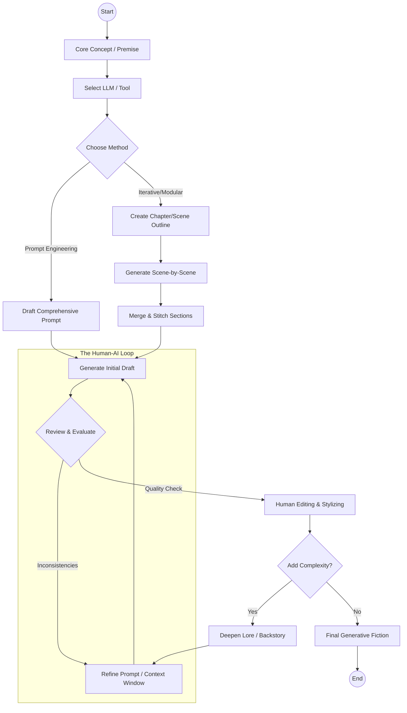

# Create a Markdown file containing the Mermaid code
markdown_content = f"""# How to Write Generative Fiction

This diagram illustrates the workflow for creating generative fiction using AI tools and human creativity.

## Explanation of the Process

1. **Core Concept**: Define what the story is about.
2. **Tool Selection**: Choose the AI model (e.g., GPT-4, Claude) that best fits the desired tone.
3. **Methodology**: Decide between generating a full story from a single detailed prompt or building it piece-by-piece.
4. **The Human-AI Loop**: The core of the process where the AI generates text, the human reviews it for logic and style, and prompts are refined to fix errors.
5. **Human Editing**: The final layer where the author polishes the prose to ensure a unique "voice."

### How to use this in Markdown
If you are using a Markdown editor that supports Mermaid (like Obsidian, GitHub, or VS Code with the right extensions), the diagram will render automatically from the code block provided in the file:

