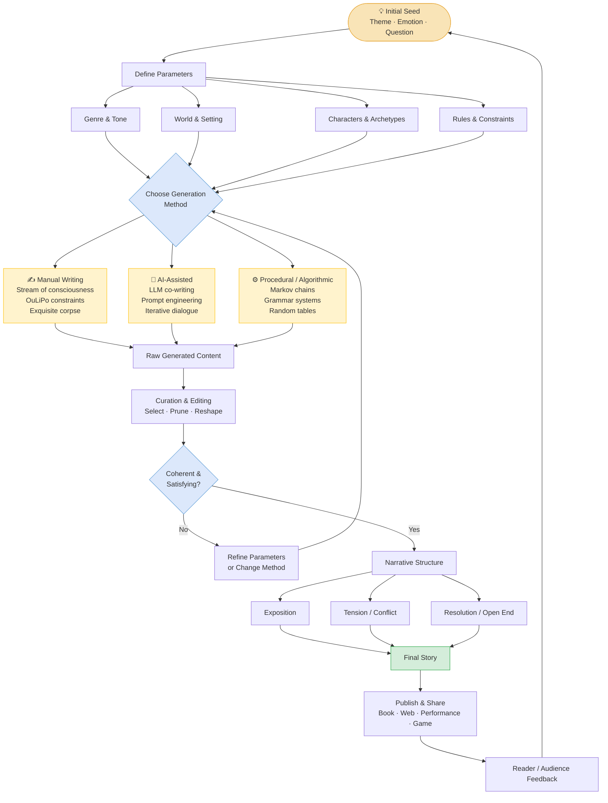

```mermaid
flowchart TD
    A([💡 Initial Seed\nTheme · Emotion · Question]) --> B

    B[Define Parameters]
    B --> B1[Genre & Tone]
    B --> B2[World & Setting]
    B --> B3[Characters & Archetypes]
    B --> B4[Rules & Constraints]

    B1 & B2 & B3 & B4 --> C

    C{Choose Generation\nMethod}

    C --> D1[✍️ Manual Writing\nStream of consciousness\nOuLiPo constraints\nExquisite corpse]
    C --> D2[🤖 AI-Assisted\nLLM co-writing\nPrompt engineering\nIterative dialogue]
    C --> D3[⚙️ Procedural / Algorithmic\nMarkov chains\nGrammar systems\nRandom tables]

    D1 --> E[Raw Generated Content]
    D2 --> E
    D3 --> E

    E --> F[Curation & Editing\nSelect · Prune · Reshape]

    F --> G{Coherent &\nSatisfying?}

    G -- No --> H[Refine Parameters\nor Change Method]
    H --> C

    G -- Yes --> I[Narrative Structure]

    I --> I1[Exposition]
    I --> I2[Tension / Conflict]
    I --> I3[Resolution / Open End]

    I1 & I2 & I3 --> J[Final Story]

    J --> K[Publish & Share\nBook · Web · Performance · Game]
    K --> L[Reader / Audience Feedback]
    L --> A

    style A fill:#f9e4b7,stroke:#e8a838,color:#333
    style C fill:#dce8fb,stroke:#5b9bd5,color:#333
    style G fill:#dce8fb,stroke:#5b9bd5,color:#333
    style J fill:#d4edda,stroke:#28a745,color:#333
    style D1 fill:#fff3cd,stroke:#ffc107,color:#333
    style D2 fill:#fff3cd,stroke:#ffc107,color:#333
    style D3 fill:#fff3cd,stroke:#ffc107,color:#333
```
